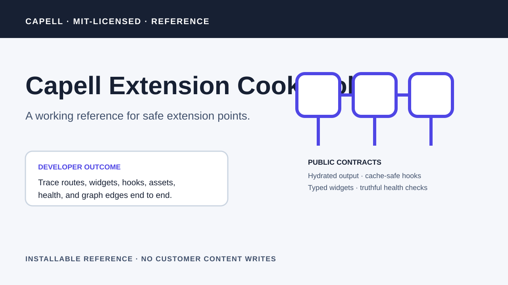

# Capell Extension Cookbook

<!-- prettier-ignore-start -->

## What This Plugin Adds

Capell Extension Cookbook is an **Available**, **Schema-owning** Capell package in the **Capell Foundation** product group. It ships as `capell-app/extension-cookbook` and extends these surfaces: admin, frontend, shared.

Extension Cookbook is a free, runnable package of small examples for Capell's released Core, Admin, Frontend, lifecycle, data, health, and content-graph contracts; experimental seams are called out as follow-up gaps.

Package authors can install one maintained example, follow each contribution from manifest to provider, and copy the focused test that proves its behaviour.

Evidence: [`capell.json`](capell.json), [`src/Providers/ExtensionCookbookServiceProvider.php`](src/Providers/ExtensionCookbookServiceProvider.php), [`docs/extension-points.md`](docs/extension-points.md), [`src/Providers/FrontendServiceProvider.php`](src/Providers/FrontendServiceProvider.php), [`src/Manifest/Core/ExtensionCookbookPageTypeContribution.php`](src/Manifest/Core/ExtensionCookbookPageTypeContribution.php), [`tests/Unit/Manifest/ExtensionCookbookManifestTest.php`](tests/Unit/Manifest/ExtensionCookbookManifestTest.php).

Status details:

- Status: Available
- Tier: free
- Bundle: foundation
- Composer package: `capell-app/extension-cookbook`
- Namespace: `Capell\ExtensionCookbook`
- Theme key: not applicable

## Why It Matters

**For developers:** Each demonstrated seam has an owning class, a documented registration path, and a focused regression test; deliberately inactive seams are labelled instead of being implied.

**For teams:** The cookbook is MIT-licensed and free to install, so teams can evaluate extension patterns without adopting a commercial feature package or copying undocumented internals.

Evidence: [`docs/extension-points.md`](docs/extension-points.md), [`src/Support/Admin/ExtensionCookbookCoverageCatalogue.php`](src/Support/Admin/ExtensionCookbookCoverageCatalogue.php), [`tests/Feature/Admin/ExtensionCookbookAdminSurfaceTest.php`](tests/Feature/Admin/ExtensionCookbookAdminSurfaceTest.php), [`LICENSE`](LICENSE), [`composer.json`](composer.json), [`capell.json`](capell.json).

## Screens And Workflow

Screenshot contract: `docs/screenshots.json`.

- Capell Extension Cookbook in the admin extension catalogue (admin, supplementary evidence).
- Extension Cookbook widget in Layout Builder (admin, supplementary evidence).
- Public Capell Extension Cookbook route (frontend, supplementary evidence).

## Technical Shape

- Service providers: `Capell\ExtensionCookbook\Providers\ExtensionCookbookServiceProvider`, `Capell\ExtensionCookbook\Providers\AdminServiceProvider`, `Capell\ExtensionCookbook\Providers\FrontendServiceProvider`.
- Config files: `packages/extension-cookbook/config/extension-cookbook.php`.
- Migrations: `packages/extension-cookbook/database/migrations/2026_08_29_000001_create_extension_cookbook_entries.php`, `packages/extension-cookbook/database/migrations/2026_08_29_000002_scope_extension_cookbook_entry_slugs.php`.
- Settings migrations: `packages/extension-cookbook/database/settings/2026_08_29_000001_add_extension_cookbook_settings.php`.
- Settings classes: `ExtensionCookbookSettings`.
- Models: `ReferenceEntry`.
- Filament classes: `ExtensionCookbookConfigurator`, `ExtensionCookbookAdminActionExtender`, `ExtensionCookbookPageSchemaExtender`, `ExtensionCookbookPage`, `ListReferenceEntries`, `ReferenceEntryResource`, `ExtensionCookbookSettingsSchema`, `ExtensionCookbookDashboardWidget`, `ExtensionCookbookOverviewStat`.
- Route files: `packages/extension-cookbook/routes/web.php`.
- Policies: `ReferenceEntryPolicy`.
- Events: `ReferenceEntryPublished`.
- Listeners: `ReferenceEntrySubscriber`.
- Actions: `AfterInstallExtensionCookbookPackageAction`, `CreateReferenceEntryAction`, `EnsureExtensionCookbookExampleAction`, `InstallExtensionCookbookPackageAction`, `ReadReferenceEntriesAction`, `SetupExtensionCookbookPackageAction`, `UninstallExtensionCookbookPackageAction`.
- Data objects: `ReferenceEntryData`, `ReferenceEntryPublishedPayloadData`.
- Jobs: `AuditExtensionCookbookHealthJob`.
- Command signatures: `capell:extension-cookbook-doctor`.
- Manifest action API: `afterInstall: Capell\ExtensionCookbook\Actions\AfterInstallExtensionCookbookPackageAction`, `install: Capell\ExtensionCookbook\Actions\InstallExtensionCookbookPackageAction`, `setup: Capell\ExtensionCookbook\Actions\SetupExtensionCookbookPackageAction`, `uninstall: Capell\ExtensionCookbook\Actions\UninstallExtensionCookbookPackageAction`.
- Scheduled commands: `Capell\ExtensionCookbook\Manifest\Frontend\ExtensionCookbookScheduledJobContribution (manifest declared)`.
- Console command classes: `ExtensionCookbookDoctorCommand`.
- Manifest contributions: `admin-action-extender: Capell\ExtensionCookbook\Manifest\Admin\ExtensionCookbookAdminActionExtenderContribution`, `admin-page: Capell\ExtensionCookbook\Manifest\Admin\ExtensionCookbookAdminPageContribution`, `admin-resource: Capell\ExtensionCookbook\Manifest\Admin\ReferenceEntryResourceContribution`, `agent-capability: Capell\ExtensionCookbook\Manifest\Core\ExtensionCookbookAgentCapabilityContribution`, `asset: Capell\ExtensionCookbook\Manifest\Frontend\ExtensionCookbookAssetContribution`, `blueprint-subject: Capell\ExtensionCookbook\Manifest\Core\ExtensionCookbookBlueprintSubjectContribution`, `configurator: Capell\ExtensionCookbook\Manifest\Admin\ExtensionCookbookConfiguratorContribution`, `console-command: Capell\ExtensionCookbook\Manifest\Frontend\ExtensionCookbookConsoleCommandsContribution`, `content-graph: Capell\ExtensionCookbook\ContentGraph\ReferenceEntryContentGraphExtractor`, `content-widget: Capell\ExtensionCookbook\Manifest\Frontend\ExtensionCookbookContentWidgetContribution`, `dashboard-widget: Capell\ExtensionCookbook\Manifest\Admin\ExtensionCookbookDashboardWidgetContribution`, `frontend-component: Capell\ExtensionCookbook\Manifest\Frontend\ExtensionCookbookFrontendComponentContribution`, `health-check: Capell\ExtensionCookbook\Health\ExtensionCookbookHealthCheck`, `migration: Capell\ExtensionCookbook\Manifest\Core\ExtensionCookbookMigrationContribution`, `model: Capell\ExtensionCookbook\Manifest\Core\ReferenceEntryModelContribution`, `outbound-event: Capell\ExtensionCookbook\Manifest\Core\ExtensionCookbookOutboundEventContribution`, `overview-stat: Capell\ExtensionCookbook\Manifest\Admin\ExtensionCookbookOverviewStatContribution`, `page-type: Capell\ExtensionCookbook\Manifest\Core\ExtensionCookbookPageTypeContribution`, `page-variation: Capell\ExtensionCookbook\Manifest\Core\ExtensionCookbookPageVariationContribution`, `permission: Capell\ExtensionCookbook\Manifest\Admin\ExtensionCookbookPermissionsContribution`, `render-hook: Capell\ExtensionCookbook\Manifest\Frontend\ExtensionCookbookRenderHookContribution`, `route: Capell\ExtensionCookbook\Manifest\Frontend\ExtensionCookbookRoutesContribution`, `scheduled-job: Capell\ExtensionCookbook\Manifest\Frontend\ExtensionCookbookScheduledJobContribution`, `schema-extender: Capell\ExtensionCookbook\Manifest\Admin\ExtensionCookbookSchemaExtenderContribution`, `section: Capell\ExtensionCookbook\Manifest\Frontend\ExtensionCookbookSectionContribution`, `setting: Capell\ExtensionCookbook\Manifest\Core\ExtensionCookbookSettingContribution`, `workflow-attention: Capell\ExtensionCookbook\Admin\Workflow\ExtensionCookbookWorkflowAttentionContribution`.
- Health checks: `Capell\ExtensionCookbook\Health\ExtensionCookbookHealthCheck`.
- Blade views: `packages/extension-cookbook/resources/views/filament/pages/extension-cookbook.blade.php`, `packages/extension-cookbook/resources/views/filament/widgets/dashboard.blade.php`, `packages/extension-cookbook/resources/views/frontend/index.blade.php`, `packages/extension-cookbook/resources/views/widget/extension-cookbook.blade.php`.
- Cache tags: `extension-cookbook`.

## Data Model

- Required tables: `extension_cookbook_entries`.
- Models: `ReferenceEntry`.
- Core record references in migrations: `sites via site_id`.
- Migration files: `2026_08_29_000001_create_extension_cookbook_entries.php`, `2026_08_29_000002_scope_extension_cookbook_entry_slugs.php`.
- Migration impact: run host migrations through the package install flow before opening package surfaces.
- Deletion/retention behaviour: migrations declare cascade-on-delete relationships; no timed pruning or retention schedule is declared in `capell.json`.

## Install Impact

- Required packages: `capell-app/admin`, `capell-app/core`, `capell-app/frontend`, `capell-app/layout-builder`.
- Admin navigation: declares `admin-page: ExtensionCookbookAdminPageContribution`, `admin-resource: ReferenceEntryResourceContribution`; each Filament page or resource controls its own navigation visibility.
- Admin/editor extensions: `admin-action-extender: ExtensionCookbookAdminActionExtenderContribution`, `configurator: ExtensionCookbookConfiguratorContribution`, `content-widget: ExtensionCookbookContentWidgetContribution`, `dashboard-widget: ExtensionCookbookDashboardWidgetContribution`, `overview-stat: ExtensionCookbookOverviewStatContribution`, `schema-extender: ExtensionCookbookSchemaExtenderContribution`, `workflow-attention: ExtensionCookbookWorkflowAttentionContribution`.
- Permissions: `View:ExtensionCookbook`, `Manage:ExtensionCookbook`.
- Public routes: loads `routes/web.php`; registers `ExtensionCookbookRoutesContribution`.
- Database changes: package migrations are declared.
- Config: `config/extension-cookbook.php`.
- Settings: `Capell\ExtensionCookbook\Settings\ExtensionCookbookSettings`.
- Queues or schedules: scheduled commands `Capell\ExtensionCookbook\Manifest\Frontend\ExtensionCookbookScheduledJobContribution (manifest declared)`; queue jobs `AuditExtensionCookbookHealthJob`.
- Cache tags: `extension-cookbook`.
- Commands: `capell:extension-cookbook-doctor`.

## Common Pitfalls

- Keep required Capell packages on compatible v4 releases: `capell-app/admin`, `capell-app/core`, `capell-app/frontend`, `capell-app/layout-builder`.
- Run migrations before opening package resources or public routes.
- Review package configuration before production-like verification: `config/extension-cookbook.php`, `Capell\ExtensionCookbook\Settings\ExtensionCookbookSettings`.
- Review middleware, throttling, signatures, and public-output safety in `routes/web.php` before exposing routes.
- Keep the host Laravel scheduler running so package-registered schedules can execute: `Capell\ExtensionCookbook\Manifest\Frontend\ExtensionCookbookScheduledJobContribution (manifest declared)`.
- Keep public Blade and cached HTML free of authoring markers, model IDs, permissions, signed editor URLs, and lazy database queries.
- Custom write integrations must preserve invalidation for `extension-cookbook` cache tags.

## Troubleshooting

| Symptom | Likely cause | Check | Fix |
| --- | --- | --- | --- |
| Package surface is missing after install | Provider or manifest is not loaded | Confirm `capell.json`, package `composer.json`, and provider registration | Reinstall the package, refresh Composer autoload, and clear host caches |
| Admin screen or command fails on missing table | Package migrations have not run | Check the tables listed in `Data Model` | Run host migrations and rerun the focused package test |
| Route returns unexpected output | Route cache, middleware, or signed URL setup does not match the package route file | Check the route files listed in `Technical Shape` | Clear route cache and verify middleware before exposing public routes |
| Background work does not run | Queue worker or declared schedule is not active | Check the jobs and scheduled commands listed in `Technical Shape` | Start the queue worker or host scheduler, then run the focused command or package test |
| Public output leaks unexpected state | Render data, cache variation, or authoring boundary has regressed | Check public Blade, cache tags, and public-output safety tests | Move data loading out of Blade and rerun the package public-output tests |

## Quick Start

1. Install the package: `composer require capell-app/extension-cookbook`.
2. Run the required setup: `php artisan migrate`.
3. Open the package admin page or resource and verify Capell Extension Cookbook is available.

## Next Steps

- [Package docs](docs/README.md)
- [Overview](docs/overview.md)
- Configuration files: [`config/extension-cookbook.php`](config/extension-cookbook.php).
- [Troubleshooting](#troubleshooting)
- [Screenshot contract](docs/screenshots.json)
- [Marketplace assets](docs/assets/marketplace/)
- [Capell content language plan](../../docs/CONTENT_LANGUAGE_PLAN.md)
- [Capell documentation design system](../../docs/DESIGN_SYSTEM.md)
- [Capell and package ERD notes](../../docs/erd/capell-and-package-erds.md)
- Related packages: [Layout Builder](../layout-builder/README.md).
- Focused tests: `vendor/bin/pest packages/extension-cookbook/tests --configuration=phpunit.xml`.

<!-- prettier-ignore-end -->
